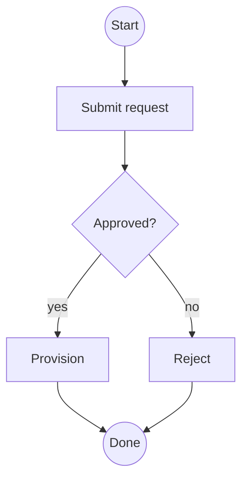
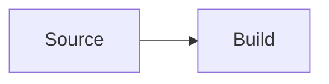
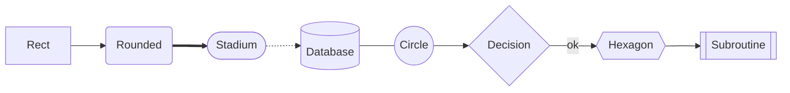
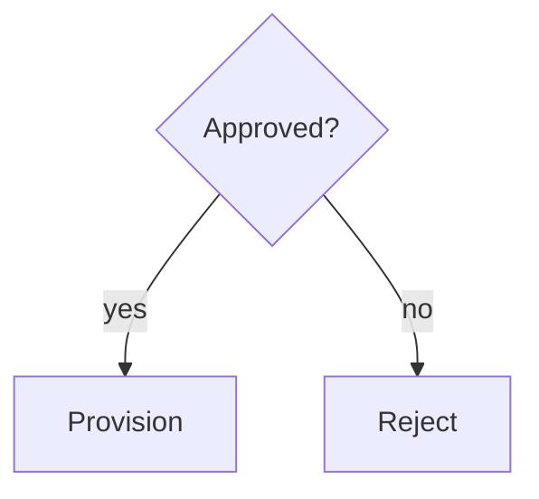
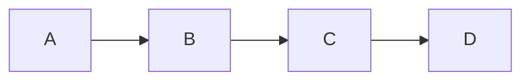
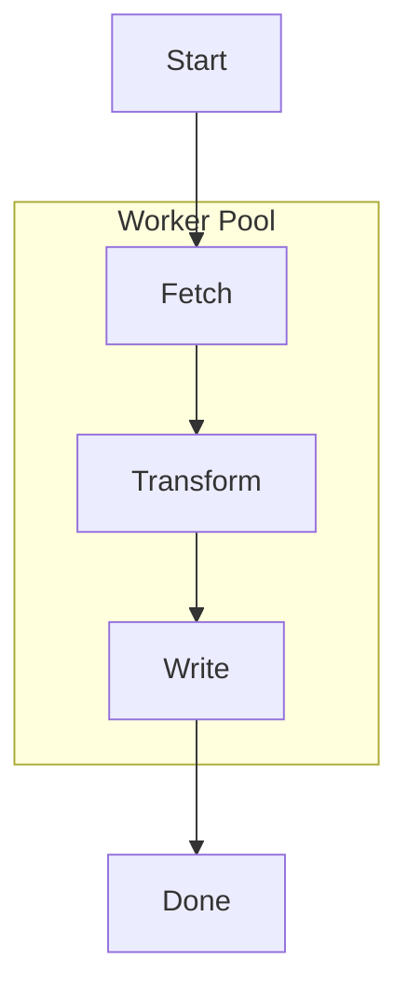

# Flowchart

A flowchart shows a process as steps connected by arrows. kymo reads the
[Mermaid](https://mermaid.js.org/syntax/flowchart.html) `flowchart` / `graph`
syntax — so a diagram you already have in Mermaid renders in kymo unchanged —
and draws it with its own pure-Rust renderer. No browser, no system libraries.




## Rendering

Save the source as a `.mmd` (or `.mermaid`) file and pass it to the `kymo` CLI —
the same command in all three distributions
([PyPI](https://pypi.org/project/kymostudio/), [npm](https://www.npmjs.com/package/kymostudio),
[crates.io](https://crates.io/crates/kymostudio)):

```bash
kymo flow.mmd flow.svg        # static SVG
kymo flow.mmd flow.png        # PNG (add -s 2 for 2× resolution)
kymo flow.mmd flow.pdf        # vector PDF
```

Flowcharts also convert to other diagram-as-code formats — see
[Exporting](#exporting) below.

## Direction

The header names the diagram type (`flowchart` and `graph` are synonyms) and an
optional direction:

| Token | Flow |
|-------|------|
| `TD` / `TB` | top → bottom (default) |
| `BT` | bottom → top |
| `LR` | left → right |
| `RL` | right → left |



## Node shapes

A node is an identifier plus an optional label wrapped in shape delimiters.
Without delimiters (`A --> B`), the node renders as a rectangle labelled with
its own id.

| Syntax | Mermaid name | kymo renders as |
|--------|--------------|-----------------|
| `A[text]` | rectangle | rectangle |
| `A(text)` | rounded | rectangle |
| `A([text])` | stadium / pill | badge (pill) |
| `A[[text]]` | subroutine | rectangle |
| `A[(text)]` | database | cylinder |
| `A((text))` | circle | circle |
| `A{text}` | decision | diamond |
| `A{{text}}` | hexagon | hexagon |
| `A>text]` | asymmetric flag | rectangle |




Labels may be double-quoted to include characters that would otherwise close
the shape: `A["a label with (parens)"]`.

> Mermaid's trapezoid (`[/ /]`, `[\ \]`) and double-circle (`((( )))`) shapes
> are not supported yet — the parser reports a syntax error.

## Links between nodes

A link is two nodes joined by an edge operator. kymo distinguishes **solid vs
dashed** and **arrow vs plain line**:

| Syntax | Meaning |
|--------|---------|
| `A --> B` | solid arrow |
| `A --- B` | solid line, no arrowhead |
| `A -.-> B` | dashed arrow |
| `A -.- B` | dashed line, no arrowhead |
| `A ==> B` | accepted; rendered as a regular solid arrow |
| `A --x B` | accepted; rendered as a solid arrow |

Label an edge either with pipes after the operator or with the inline `--`
form — both are supported:



Links chain on a single line; each operator connects the two nodes around it:



> The `&` fan-out shorthand (`A & B --> C`) is not supported — write one link
> per line instead.

## Subgraphs

`subgraph … end` groups nodes into a labelled container. The id and the title
are both optional (`subgraph Title`, `subgraph id [Title]`, or a bare
`subgraph`), titles may be quoted, and subgraphs nest.



A `direction` statement inside a subgraph is accepted but ignored — the whole
diagram flows in the header direction.

## Comments

Lines starting with `%%` are comments:


## Other text formats: D2 and Graphviz DOT

The flowchart pipeline is format-neutral — kymo also imports
[D2](https://d2lang.com) and [Graphviz DOT](https://graphviz.org) sources and
renders them with the same layout engine:

```bash
kymo flow.d2  flow.svg        # D2  -> SVG
kymo flow.dot flow.svg        # DOT -> SVG
```

## Exporting

From a Mermaid flowchart, the output extension picks the target:

```bash
kymo flow.mmd flow.svg        # SVG (also .png, .pdf)
kymo flow.mmd flow.d2         # D2
kymo flow.mmd flow.dot        # Graphviz DOT
kymo flow.mmd flow.drawio     # draw.io (mxGraph XML), opens in diagrams.net
kymo flow.mmd norm.mmd        # Mermaid round-trip (normalized)
kymo flow.mmd                 # .kymo.json (kymo interchange model)
```

The Python CLI additionally offers `--animate` (animated SVG), `--excalidraw`,
and `--figma` targets — see the [Getting Started guide](../guide/getting-started).

## Differences from Mermaid

kymo implements the structural core of the flowchart grammar. Styling and
interactivity directives are **not** supported and are reported as syntax
errors: `style`, `classDef`, `class`, `click`, and `linkStyle`. Keep sources to
nodes, links, subgraphs, and comments.

## See also

- [Sequence Diagram](./sequence) — the second Mermaid diagram type kymo imports.
- [Flowchart Notation (ISO 5807)](./flowchart-notation) — background reference
  on classic flowchart symbols and conventions.
- [Best Practices](./best-practices) — layout and readability guidance.
