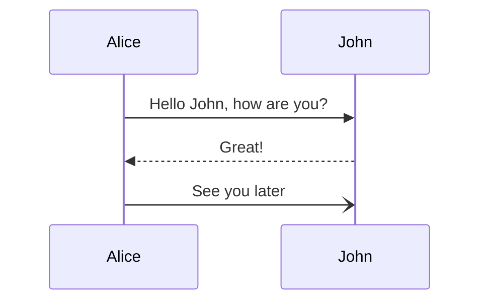
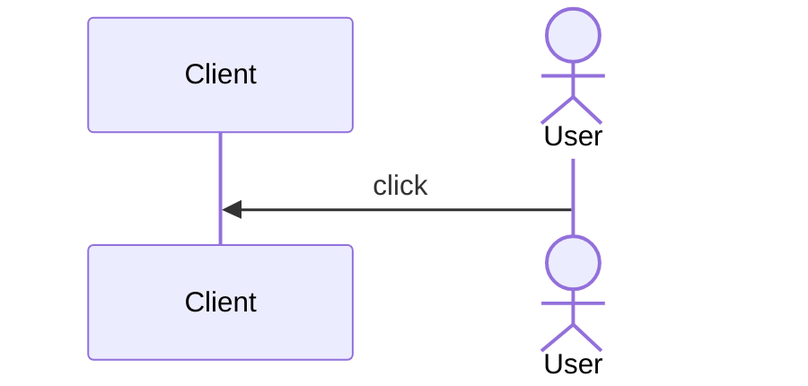
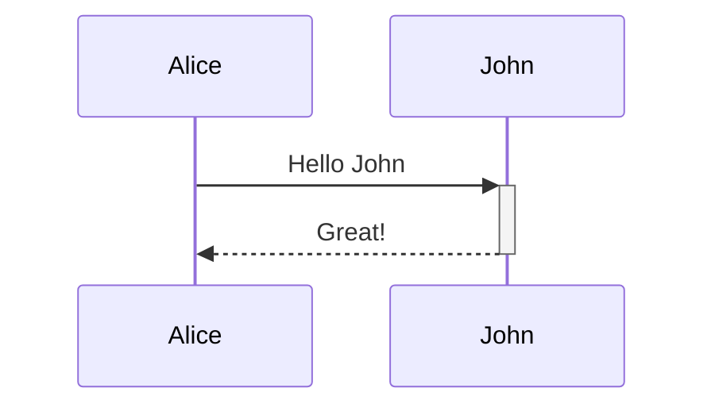
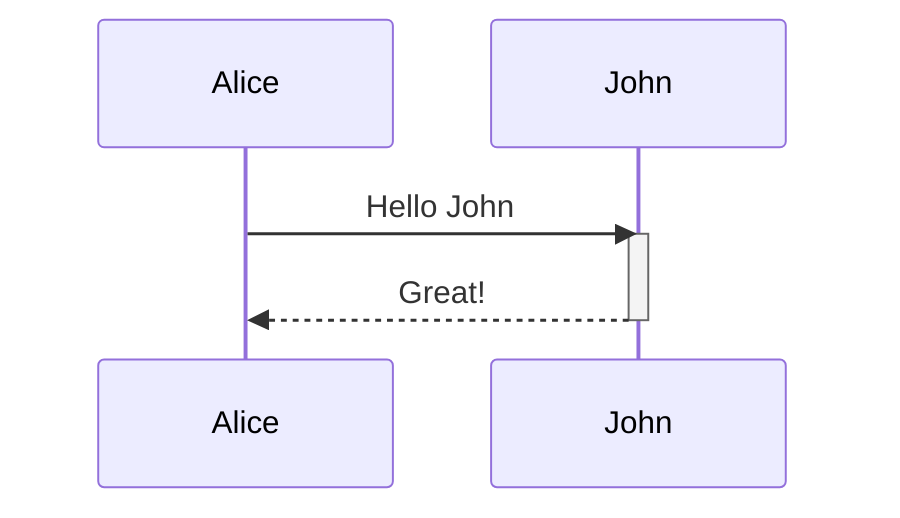
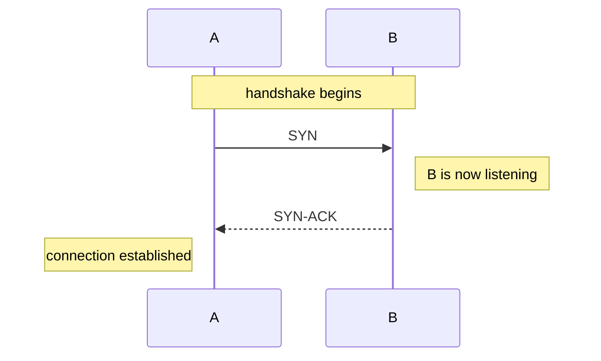
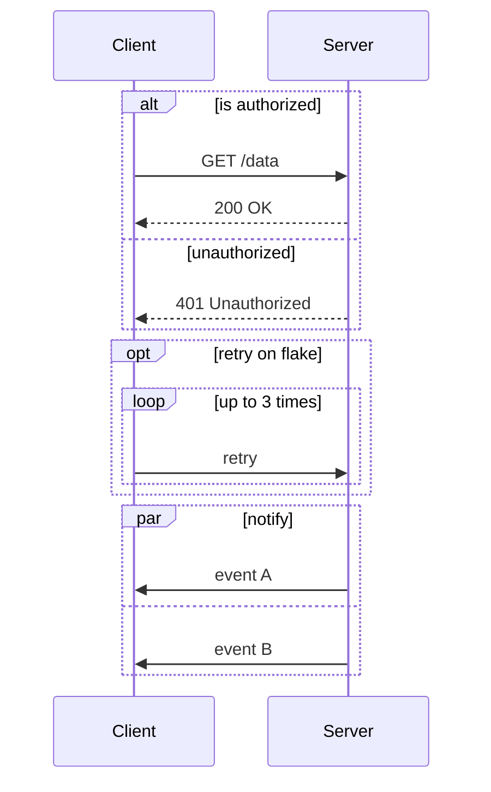
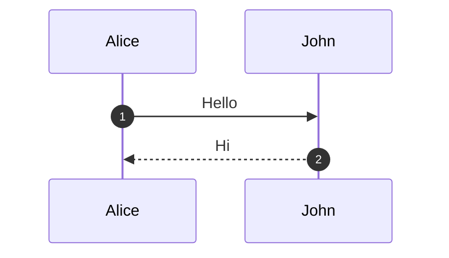

# Sequence Diagram

A sequence diagram shows how participants exchange messages over time. kymo
reads the [Mermaid](https://mermaid.js.org/syntax/sequenceDiagram.html)
`sequenceDiagram` syntax and converts it into a proper **UML interaction
model** — ready to open in StarUML, Gaphor, or any XMI-consuming UML tool.



> **Status.** Sequence diagrams currently export to UML tool formats (XMI,
> StarUML, Gaphor) via the Rust CLI — direct SVG rendering is on the roadmap.
> See [Exporting](#exporting).

## Participants

Declare participants with `participant`, or `actor` for a stick-figure actor.
The optional `as` alias sets the display label; the id is what you use in
messages. Participants you don't declare are created automatically the first
time a message references them, in order of appearance.



## Messages

A message is `Sender<arrow>Receiver: text`. Each arrow maps to a UML message
sort, so the distinction survives into the exported model:

| Syntax | Line | UML message sort |
|--------|------|------------------|
| `A->>B: text` | solid, filled head | synchronous call |
| `A-->>B: text` | dashed, filled head | reply |
| `A->B: text` | solid, open head | asynchronous signal |
| `A-->B: text` | dashed, open head | asynchronous signal |
| `A-)B: text` | solid, open head | asynchronous call |
| `A--)B: text` | dashed, open head | asynchronous call |
| `A-xB: text` | solid, × head | asynchronous call |
| `A--xB: text` | dashed, × head | asynchronous call |

Self-messages (`A->>A: think`) are supported.

## Activations

Mark when a participant is actively processing with explicit statements or the
`+` / `-` shorthand on the arrow:





`+` activates the **target** after the message; `-` deactivates the **source**.

## Notes

Attach commentary to one participant or span several:



`Note left of X`, `Note right of X`, and `Note over X` (or `Note over X,Y`)
are all supported.

## Fragments: loop, alt, opt, par

Combined fragments group messages under an operator, close with `end`, and
nest arbitrarily:



| Operator | Meaning |
|----------|---------|
| `loop label … end` | repetition |
| `alt guard … else guard … end` | mutually exclusive alternatives |
| `opt guard … end` | optional block |
| `par label … and … end` | parallel blocks |

These map to UML combined fragments (`loop`, `alt`, `opt`, `par`) with the
labels carried as guards.

## Numbering

`autonumber` switches on sequential message numbering:



## Exporting

Save the source as a `.mmd` (or `.mermaid`) file; with the Rust CLI
(`cargo install kymostudio`) the output extension picks the UML target:

```bash
kymo seq.mmd seq.xmi          # OMG XMI 2.5.1 — portable UML interchange
kymo seq.mmd seq.mdj          # StarUML project, model + laid-out diagram
kymo seq.mmd seq.gaphor       # Gaphor project, model + laid-out diagram
```

- **`.xmi`** is the vendor-neutral model: import it into Enterprise Architect,
  Modelio, or any XMI 2.5 consumer.
- **`.mdj`** and **`.gaphor`** are native project files — open them directly in
  [StarUML](https://staruml.io) or [Gaphor](https://gaphor.org) and the diagram
  is already drawn.

## Differences from Mermaid

- **Accepted and ignored** (no error, no effect): `box`/`end` participant
  boxes, `rect` background highlights, `title`, `links`/`link`,
  `create`/`destroy` participant lifecycle, and `autonumber` format arguments.
- **Not supported**: the `critical` and `break` fragments.
- **No SVG output yet** — rendering sequence diagrams with kymo's own renderer
  is planned; today the pipeline targets UML tools.

## See also

- [Flowchart](./flowchart) — the other Mermaid diagram type kymo imports.
- [BPMN](./bpmn) — for multi-participant business processes with execution
  semantics.
